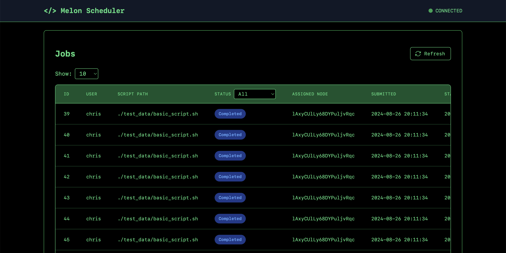

[](https://codecov.io/github/protortyp/melon)
[](https://deps.rs/repo/github/protortyp/melon)

# 🍉 Melon


> [!NOTE]
> TLDR: Slurm, but with job extension capabilities!

`Melon` is a lightweight distributed job scheduler written in Rust. This is a minimal **MVP** I wrote for fun while complaining about slurm. The one and only reason I worked on this is that slurm doesn't support extending the allocated time for a job. Melon does! No more timeout errors!! 🥳🥳

Components that have been implemented so far:

- [x] `melond` the melon daemon master node
- [x] `mbatch` the submit command
- [x] `mworker` compute node
- [x] `mqueue` see pending and running jobs
- [x] `mcancel` the cancel command
- [x] `mextend` to extend jobs
- [x] `mshow` a better job info command (to use instead of `mstat`)
- [x] job info persistence
- [x] cgroups management
- [x] UI

**Stuff that's missing:**

- [ ] cgroups delegation (for non-privilged cgroups write access)
- [ ] master node recovery
- [ ] compute node recovery

## Getting Started

Install all tools using `./install-all.sh`

### Start the Daemon

Run the `melond` service. This is the master node that the other tools communicate with. You can override the local port `melond --port 8081`. All tools use IPv6 by default. So if you're behind a docker instance, make sure to follow [the guide at the end](#contributing).

```bash
melond --port 8081

# for pretty-print
cargo install bunyan
melond --port 8081 | bunyan
```

### Compute Nodes

Then spin up a couple of `mworker` compute nodes. Currently the available resources are read from the environment but that will change in the future. On Linux, we use `cgroups` to limit the available resources per job, based on the memory and cpu requirements that were requested. Resource limitations is thus not available on Mac/Windows.

Currently, cgroup delegation is not implemented. Therefore, in order to use the `cgroups` feature, make sure to run the `mworker` command as privileged user. Almost all cool features from slurm are of course not implemented. But the basics will get you going. You can override the api endpoint and it's own port.

```bash
# on linux
sudo mworker --api_endpoint "http://[::1]:8080" --port 8082

# on mac / windows => no resource limits besides timeout though!
mworker --api_endpoint "http://[::1]:8080" --port 8082
```

### Submit Jobs

Then to submit a job, first create a simple batch script `my_job.sh`. We use drop-in replacements for `SBATCH` instructions. Creatively as I am, we will use `MBATCH`.

```bash
#!/bin/bash
#MBATCH -c 4
#MBATCH -t 0-06:00
#MBATCH -m 1G

for i in $(seq 2 100); do
  echo "$i melons are better than $((i-1))"
  sleep 1
done
```

And submit the job using `mbatch`

```bash
mbatch my_job.sh
```

You can also pass parameters to your job script `my_job.sh`:

```bash
n_parts=10
for i in $(seq 0 $n_parts)
do
  mbatch my_job.sh $n_parts $i
done
```

You can override the api endpoint if needed. Just make sure to override the endpoint before you pass the script and it's arguments.

```bash
mbatch -a "http://[::1]:8080" my_job.sh arg1 arg2
```

### List Jobs

```bash
$ mqueue # again, override using --api_endpoint "http://[::1]:8080"
# Output:
JOBID   NAME         USER   ST   TIME     NODES
12      test_data/   chris  PD   0-00-00  (PD)
13      test_data/   chris  PD   0-00-00  (PD)
10      test_data/   chris  R    0-00-01  RwcSZDtzXnHm55PBcY6xS
11      test_data/   chris  R    0-00-01  RwcSZDtzXnHm55PBcY6xS
```

### Extend Jobs 🥳🥳🥳

To extend the requested time for a pending or running job (the reason for the existence of this whole project...). Again, the `--api_endpoint` / `-a` override argument is available.

```bash
# extend by one hour
mextend -j $JOBID -t 0-01-00

# extend by one day
mextend -j $JOBID -t 1-00-00

# extend with override
mextend -j $JOBID -t 1-00-00 -a "http://[::1]:8080"
```

### Cancel Pending or Running Jobs

To cancel a pending or running job:

```bash
mcancel $JOBID

# or
mcancel -a "http://[::1]:8080" $JOBID
```

### `mshow`

The get more detailed information about a past, pending or running job, `mshow` provides an easy to use interface.

```bash
mshow $JOBID
 JOBID  NAME             USER   STATUS     SUBMIT DATE          START DATE           STOP DATE            NODES
 288    basic_script.sh  chris  Completed  2024-08-11 23:27:36  2024-08-11 23:27:47  2024-08-11 23:27:59  3eKNIu_I3XNlnIl_dRT12
```

To get the information in json, run `mshow $JOBID --parseable` or `mshow $JOBID -p`

```json
{
  "id": 288,
  "user": "chris",
  "script_path": "./test_data/basic_script.sh",
  "script_args": ["a", "b", "c"],
  "req_res": {
    "cpu_count": 1,
    "memory": 1073741824,
    "time": 360
  },
  "submit_time": 1723418856,
  "start_time": 1723418867,
  "stop_time": 1723418879,
  "status": "Completed",
  "assigned_node": "3eKNIu_I3XNlnIl_dRT12"
}
```

### UI



Right now, the UI keeps things simple by showing a list of jobs with all their details. It's pretty basic, but there are some plans for the future! Future features will let you do things like cancel jobs or give them more time to run.

## Contributing

If you're using the devcontainer, make sure to enable `ipv6` in your docker engine.

```json
{
  "ipv6": true,
  "fixed-cidr-v6": "2001:db8:1::/64"
}
```
